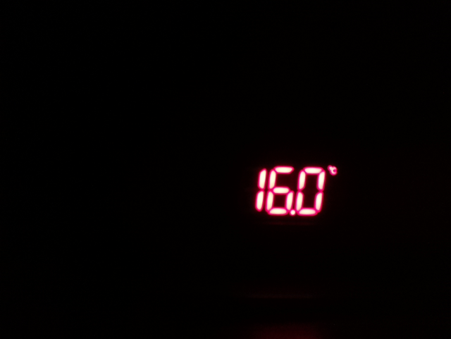
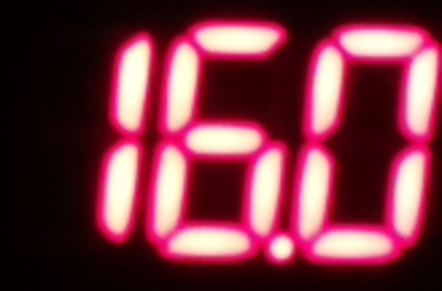
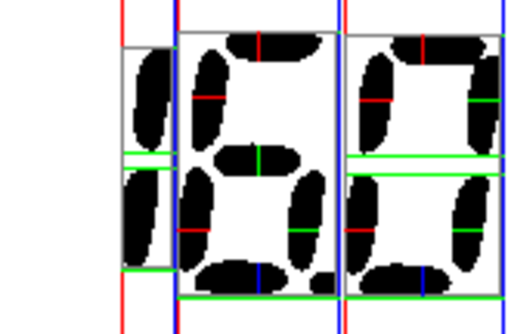

# Still Monitor

Reads the temperature off a 7-segment LED thermostat display **optically** — a Raspberry Pi
camera points at the readout, the image is cropped and thresholded, and
[`ssocr`](https://github.com/auerswal/ssocr) decodes the digits. Readings are logged to a
timestamped CSV and served through a browser control panel, for monitoring a distillation run
over several hours.

The display can't be tapped electrically, hence the camera. It turns out to be a perfectly good
sensor: a validated run produced 216 readings with zero misreads, and later runs have held an
exact 30.00 s cadence across service restarts.

## What it does

- **Tunes** the crop box, threshold and brightness/contrast live in the browser, with a
  three-panel view of what the camera sees, what gets cropped, and what `ssocr` actually reads
- **Logs** on an absolute-time schedule to `temps_YYYYMMDDHHMM.csv`
- **Annotates** runs with notes that capture a reading *immediately* rather than waiting for the
  next interval, including six configurable one-tap buttons
- **Charts** each run as a self-contained HTML file with note markers, a target line and the
  detected plateau, plus a zoomed second panel around the plateau — on a run from 18 °C to
  79 °C the fluctuation that matters occupies about 5% of the main chart's height
- **Validates** every reading: a range gate, and a rate-of-change gate that rejects
  physically impossible jumps. A glare misread turning a `1` into a `7` reads 76.2 instead of
  16.2 and passes every other check; 120 °C/min does not
- **Watches** run health: consecutive-misread alerts, sudden-jump alerts, rate of change in
  °C/min, and a "process likely finished" alert when the temperature rises off a plateau
- **Works on a phone** — the panel is laid out for a small screen, so a run can be checked
  from anywhere on the LAN
- **Survives** power cuts — systemd restarts the service and the run resumes into the same CSV,
  on the original schedule grid

## How it works

Each reading passes through three stages. These are real images taken straight off the Pi:

**1. Capture the frame.** Auto-exposure, half resolution. The display is a small bright patch in
a mostly dark scene — which is exactly why the exposure has to be left alone and everything else
done in software.



**2. Crop and adjust.** The tuned crop box isolates the digits, and brightness/contrast are
applied before thresholding. Note what's been deliberately excluded: the `°C` symbol at the top
right. Leave it in and `ssocr` counts it as a fourth digit and the whole reading fails.



**3. Threshold and decode.** What `ssocr` actually sees, with its segment-detection overlay. The
threshold is set high so dim glare falls away while the LEDs survive.



The decoded digits are `160`. The decimal point is then inserted by us — `16.0` — because
`ssocr`'s own dot detection is unreliable on a multiplexed display. Finally the value is
range-gated to reject anything physically impossible.

In commands:

1. `raspistill -o frame.jpg -w 820 -h 616 -t 500 -n` — auto-exposure, half resolution
2. `convert frame.jpg -crop {geometry} +repage -brightness-contrast {b}x{c} crop.png`
3. `ssocr -d 3 -t {threshold} make_mono invert crop.png` → e.g. `160`
4. Strip dots, insert the decimal point manually (`160` → `16.0`), then range-gate the result

Crop coordinates live in capture-resolution space. Changing the resolution from the panel
rescales the crop box automatically so the tuning survives, but the reading is worth
re-checking afterwards — sharpness and noise differ between resolutions.

## Requirements

Built against a deliberately old stack, because that's what the hardware is:

| | |
|---|---|
| Board | Raspberry Pi 3 (armv7l) |
| Camera | Raspberry Pi Camera Module v2 (Sony IMX219) |
| OS | Raspbian Stretch (Debian 9) |
| Python | **3.5** — no f-strings, no `subprocess.run(capture_output=…)`, no `ThreadingHTTPServer` |
| Camera stack | legacy `raspistill` (`start_x=1`, `gpu_mem=128`), not `libcamera` |
| Image tools | ImageMagick 6 (`convert`), `ssocr` ≥ 2.25 |

No Python packages are required beyond the standard library — no matplotlib, no web framework,
no JavaScript dependencies. That's deliberate: the target is an end-of-life OS where installing
anything is a small adventure.

## Configuring the Pi

All of this is done once, before installing the service.

**Enable the camera and SSH.** `sudo raspi-config` → *Interface Options* → enable **Camera** and
**SSH**, then reboot. On older OS versions that camera setting writes these to `/boot/config.txt`:

```
start_x=1
gpu_mem=128
```

Both are required for the legacy `raspistill` stack. Verify the camera works before going
further:

```sh
raspistill -o test.jpg -t 1000 -n
```

If that produces a black or empty file, fix it before touching this project — nothing downstream
can work without it.

**Set the timezone and confirm NTP.** A Pi has no real-time clock, so every timestamp in your
data comes from network time. If it boots without a network, timestamps will be wrong until NTP
syncs.

```sh
sudo raspi-config     # Localisation Options -> Timezone
timedatectl           # expect "NTP synchronized: yes"
```

**Give it a stable address.** The panel is reached over the LAN, so either set a DHCP
reservation on your router or rely on mDNS (`<hostname>.local`, provided by `avahi-daemon`,
which is installed and running by default). Set a memorable hostname with
`sudo hostnamectl set-hostname <name>`.

**Point the camera.** Fixed focus, so distance matters more than anything: fill a good part of
the frame with the digits and keep the sensor square to the display. Getting the rig physically
stable matters more than any software setting, because the crop box is tied to where the display
sits in the frame. Nudge the camera and you re-tune.

**Deal with reflections at the display, not in software.** Glare is the single most common cause
of misreads, and every software fix costs margin somewhere. A reflection landing on an unlit
segment can make the reading *plausibly wrong* rather than obviously broken — a `1` read as a
`7` turns 16.2 into 76.2, which passes every validity check there is. Worth trying, roughly in
order of effort:

- angle the camera a few degrees off the display's normal, so reflections bounce away from the
  lens rather than into it
- shade the display, or shield it from whatever light source is reflecting — a simple hood
  around the camera or above the display does a lot
- keep bright, glossy or light-coloured surfaces out of the display's line of sight
- for stubborn reflections, a **polarising filter** over the lens: light reflected off a glossy
  display cover is partially polarised, so a rotatable polariser can cut it substantially while
  barely touching the LED output. Fitting one to a Pi Camera Module means a holder in front of
  the lens rather than a threaded filter, so it's a build rather than a purchase.

Software can only threshold what the sensor gives it. A minute spent moving a lamp is worth more
than an hour of tuning.

## Running on newer Raspberry Pi OS

This was built on Raspbian Stretch with Python 3.5 because that's the hardware it runs on, and
the code is held to 3.5 syntax throughout. **Nothing here depends on Python being old** — it's
all standard library, so it should run unmodified on any Python 3.5+, including current
versions.

The one genuine incompatibility is the camera. Bullseye and later replace `raspistill` with
`libcamera-still` / `rpicam-still`, and Bookworm drops the legacy stack entirely. The capture
calls are deliberately isolated in **`PiBackend` in `capture.py`** — three small methods — so a
port means changing that class and nothing else:

```python
# roughly, for rpicam-still / libcamera-still
["rpicam-still", "-o", dest, "--width", str(w), "--height", str(h),
 "-t", "500", "-n"]
```

Also watch for **ImageMagick 7**, where `convert` is deprecated in favour of `magick` — that
affects the two `convert` calls in the same file.

This is untested on newer versions; I have no newer Pi to try it on. If you port it, the sim
mode (`--sim`) lets you check everything except the camera path on any machine.

## Installing

### 1. Dependencies

```sh
sudo apt-get install -y imagemagick build-essential libimlib2-dev git
```

On end-of-life Raspbian Stretch the default apt repos return 404. Point `/etc/apt/sources.list`
at the archive first:

```
deb http://legacy.raspbian.org/raspbian/ stretch main contrib non-free rpi
```

If apt complains about "valid until", add `-o Acquire::Check-Valid-Until=false`.

### 2. Build ssocr

`ssocr` isn't packaged; it's built from source, so it won't survive an SD card reflash unless
you repeat this:

```sh
git clone https://github.com/auerswal/ssocr.git
cd ssocr
make
sudo make install          # installs to /usr/local/bin/ssocr
ssocr --version            # expect 2.25.1 or newer
```

### 3. The service

```sh
git clone <this-repo> ~/Documents/templog
cd ~/Documents/templog
python3 stillmon.py                     # test it in the foreground first
```

Open `http://<pi-address>:8001/`. Once it works, install the systemd unit so it starts at boot
and restarts on crash:

```sh
sudo cp stillmon.service /etc/systemd/system/
sudo systemctl daemon-reload
sudo systemctl enable --now stillmon
journalctl -u stillmon -f
```

The unit assumes the project lives at `/home/pi/Documents/templog` and runs as user `pi`. Edit
`WorkingDirectory`, `ExecStart` and `User` if yours differs.

If `avahi-daemon` is running (it is by default on Raspberry Pi OS), the panel is reachable at
`http://<hostname>.local:8001/` — no IP needed. `sudo hostnamectl set-hostname <name>` changes
that name.

## Using it

<!-- Screenshots still to add — take these from a browser and drop them in images/:
       images/panel-monitor.png    the Monitor tab mid-run, ideally with an alert showing
       images/panel-tuning.png     the Setup tab, three panels and sliders
       images/chart.png            a saved run chart with note markers
       images/rig.jpg              the camera pointed at the thermostat
     then link them with:            -->

The panel has two tabs. **Monitor** is what you watch during a run; **Setup & tuning** holds
everything you configure beforehand and is locked while logging, because the camera can't tune
and log at the same time.

**Tune first.** On Setup, grab a frame and drag the crop box over the digits. Crop tight — a
status LED or a `°C` symbol inside the box is read as an extra digit and fails the whole
reading. Adjust brightness and contrast until the background is black and the digits are clean;
that pair, not the threshold, is what defeats glare. Save when the reading is right.

**LED or LCD?** The **Invert** switch on the tuning row has to match the display technology, and
gets it exactly backwards if you guess. `ssocr` wants dark digits on a light background:

| Display | Looks like | Invert |
|---|---|---|
| LED, emissive (a lit thermostat readout) | bright digits on black | **on** |
| LCD, passive (a probe thermometer) | dark digits on grey | **off** |

An LCD is not lit from within — it modulates whatever light falls on it. That reverses two habits
from the LED case: it needs the display face **well lit** rather than shaded, and it has a narrow
viewing cone, so a few degrees off-axis washes the digits out to flat grey. If the camera sees a
featureless grey rectangle, change the angle before changing any setting.

Expect an LCD to be fussier. Measured on the same rig, an LED decoded correctly across ~20
threshold values while an LCD managed 2–3, because grey-on-grey has far less contrast than
red-on-black.

**Presets.** Tuning is saved per display under a name — *Save as…* on the tuning row, then
*Load* to switch. A preset stores the crop box, threshold, brightness, contrast, top-trim,
capture resolution and the invert flag, so swapping between an LED thermostat and an LCD probe
is one click rather than a full re-tune. Presets live in `presets.json` (gitignored, per-machine)
and are rescaled if loaded at a different capture resolution.

**Don't tune for one moment's lighting.** A value that reads correctly right now can sit at the
edge of the range that works, and fail hours later when the light changes. The threshold that
survives is the one in the middle of the band, found by sweeping rather than nudging:

```sh
# on the Pi, against a captured frame, with your saved brightness/contrast
convert frame.jpg -crop 164x108+428+294 +repage -brightness-contrast -71x67 t.png
for t in $(seq 0 2 100); do
  printf "%s %s\n" "$t" "$(ssocr -d 3 -t $t make_mono invert t.png 2>/dev/null)"
done
```

Do that with the room lights **on** and again with them **off**, then take the middle of the
overlap. On this rig that gave 12–76 lit, 14–52 dark, so 33 — a value with roughly 19 points of
margin in both conditions, where the reading that merely "works" was sitting 8 points from
failure.

If the sliders differ from what's saved, the panel says **"unsaved changes — the logger uses
the SAVED tuning"** and marks the Tuning tab. The preview follows the sliders, but the logger
reads `crop.json`, so an unsaved change means a perfect-looking panel and a run that misreads
every frame. Starting a run in that state asks for confirmation.

**Then run.** Set interval and duration on Setup (duration 0 = until stopped), switch to
Monitor, press Start. Add notes as events happen — "first drops", "hearts", "tails" ship as
one-tap buttons and every button is editable, including what text it writes to the log.

Charts omit the service's own markers — run stopped, logging resumed, service restarted — so
they read as a process record. The **include service markers** checkbox next to the chart
buttons brings them back when you are diagnosing an interruption rather than reading the run.

**Afterwards.** Each run appears in the runs list with its reading and note counts. View the
chart live at any time, save it to disk, download the CSV, resume a run that was stopped too
early, or delete it. The chart is auto-saved once when a run stops.

## Samples

A distillate sample has to cool before a hydrometer reading means anything, so the numbers
arrive long after the moment they describe. **Sample drawn now** records the time and the
still temperature at that instant; the sample then waits in a pending list until you fill in
volume, temperature and ABV, and the row is written against the **original** timestamp so it
lands in the right place on the chart.

The ABV is temperature-corrected automatically into `sample_abv_corrected`, using a linear
rule — subtract `abv_correction_per_c` (default 0.30) for every degree above
`abv_reference_temp` (default 20 °C). Both are editable in Settings.

That rule is an approximation. The real correction is non-linear and depends on ABV as well
as temperature; proper tables exist (OIML R 22, or TTB Gauging Manual Table 1 for proof).
The default was calibrated against hand corrections at 30–33 °C and 85–95% ABV, so trust it
near there and less so far outside. To find your own coefficient, measure a sample at
working temperature, cool it to 20 °C, measure again, and divide the difference by the gap.

## Configuration

| File | Holds | Written by |
|---|---|---|
| `crop.json` | Tuning: crop box, top-trim, threshold, brightness, contrast, capture resolution | Save on the tuning panel |
| `settings.json` | Interval, duration, decimals, alert thresholds, note buttons, target line | Save on the settings panel |
| `run_state.json` | Present only while a run is active; drives crash recovery | The service, on start/stop |
| `presets.json` | Named tuning presets, one per display | Save as… on the tuning panel |
| `pending_samples.json` | Samples marked but not yet filled in | Marking and logging samples |

`settings.json` and `run_state.json` are gitignored — they're per-machine state. `crop.json` is
committed as an example, but it belongs to one specific camera position and **you will need to
re-tune**. Deploying never overwrites either file on the Pi.

Writes are kept light: the CSV append is the only frequent one. Charts render in memory and only
touch the disk when you ask, or once when a run ends.

## Data format

`timestamp,raw,value,note`

- `timestamp` — ISO 8601, e.g. `2026-07-26T19:49:14.948236`
- `raw` — exact `ssocr` output, kept for debugging; empty on a misread
- `value` — parsed float as a string, e.g. `16.5`; empty on a misread or an out-of-range read
- `note` — free text, empty on normal readings

Two gates guard a reading. It must have exactly the expected digit count and fall inside
`temp_min`…`temp_max` (default −40…120 °C); and it must not imply a rate of change above
`max_rate_per_min`. The second exists because the first cannot catch a *plausible* misread —
glare on an unlit segment turns 16.2 into 76.2, which is a perfectly ordinary temperature.
Nothing physical moves that fast, so an impossible rate is the tell.

Set `max_rate_per_min` to suit the equipment: a directly-heated still ramps at 25 °C/min
during heat-up, so a limit of 20 discards good data. A rejected reading keeps its raw `ssocr`
string, so it is recoverable from the CSV rather than lost.

 Anything else is written with a blank `value`, so
misreads are visible in the data rather than silently dropped. Rows with a blank `value` are
excluded from the chart.

Note that `decimals` is applied *before* the range gate: on a display reading `16.5`, choosing 0
decimals yields `165 °C`, which is out of range and logged as a misread.

## Development

The capture path needs `raspistill`, ImageMagick and `ssocr`, none of which exist on a typical
dev machine. There's a simulator for everything else:

```sh
python3 stillmon.py --sim              # http://localhost:8001/
python3 stillmon.py --sim --sim-speed 60 --sim-misread-every 20
```

It replays a stored frame and synthesises a scripted still run — ambient, ramp, plateau, then
the rise that means the process is finished — which is what exercises plateau detection and the
alert thresholds. **Tuning behaviour is not simulated**: all three panels show the same
unprocessed frame, because there's no image tooling to run. Camera and OCR behaviour must always
be verified on the Pi.

Deploying:

```sh
./deploy.sh                    # syntax gate, sanity checks, copy, restart
./deploy.sh --check            # checks only
./deploy.sh --install-service  # also install/refresh the systemd unit
./deploy.sh --force            # deploy under a live run; it resumes afterwards
```

Set `STILLMON_PI` to point at your Pi (default `pi@raspberrypi.local`). The script copies code
only — never tuning, settings or run data — refuses to interrupt a live run unless forced, gates
every deploy on the Pi's own Python 3.5 (a modern Python accepts f-strings that die there), and
checks the control panel's inline handlers resolve.

## Gotchas

Hard-won, and worth knowing before changing anything:

- **`raspistill -ex off` produces a black frame** on this firmware — it disables auto-exposure
  and zeroes sensor gain. `-ev` and `-ISO` are overridden by auto-exposure too. Rely on
  auto-exposure and do *all* image adjustment in software.
- **Use `ssocr -d 3`, not `-d -1`.** Auto-count invents phantom `1`s from noise and returns long
  garbage strings; a fixed digit count fails cleanly instead.
- **`ssocr -t` is a percentage, 0–100.** Anything outside that range is rejected and `ssocr`
  silently falls back to its own default of **50** — so a "threshold" of 130 and one of 227
  aren't different settings, they're both 50, and the thresholded image is byte-identical.
  This project shipped a 10–254 slider for a while and wasted real debugging time on a control
  that did nothing above 100. Stored values above 100 are rewritten to 50 on load, which
  preserves behaviour exactly.
- **The usable threshold band is narrow and not where you'd guess.** On this display, with
  brightness/contrast tuned, decoding works from about 15 to 55 and fails from 60 to 100 as
  noise gets counted as extra digits. Sweep it rather than nudging it — a value that works may
  be sitting at the edge of the band.
- **Brightness does more than threshold.** With no brightness/contrast adjustment, a glare-lit
  display misread at 15 of 21 thresholds tested; with it, 20 of 21 worked. If glare appears,
  reach for brightness first.
- **Colour separation does not help here.** Isolating "redness" (`R−B`, `R−G`, `R−max(G,B)`) to
  reject white glare is an appealing idea and it fails badly: measured 0 of 21 thresholds
  decoding correctly, versus 20 for plain brightness/contrast. Two reasons — bright LED cores
  overexpose towards white and lose their colour, and the worst glare is a reflection *of the
  red display*, so it shares the digits' hue.
- **`invert` is required** — the display is bright-on-dark and `ssocr` wants dark-on-light.
- **The decimal point is inserted by us, not read by `ssocr`** — its dot detection is unreliable
  on a multiplexed display.
- **Glare can bridge the tops of the digits** and merge them into one. Fix it with a high
  threshold plus top-trim, both in software.
- **Anything at the edge of the crop counts as a digit** — a status LED or a `°C` symbol will be
  read as a fourth digit and fail the whole reading. Crop tight.
- **Resolution barely affects capture time** (measured 1.38 / 1.37 / 1.50 s at 820×616,
  1640×1232 and 3280×2464). The cost is the settle time, not the pixel count.
- **The panel's JavaScript lives inside a Python string.** It must stay a raw string (`r"""`) or
  Python eats escapes meant for the browser, and one bad escape silently kills every handler on
  the page.

## Repo layout

```
stillmon.py    the service: HTTP server, control panel, routing
capture.py     capture + OCR pipeline, behind a backend interface (real / simulated)
runner.py      the logging engine: scheduling, notes, alerts, crash recovery
chart.py       hand-built SVG chart and self-contained HTML output
config.py      the three config files, with atomic writes
deploy.sh      deploy to the Pi, with a Python 3.5 gate and sanity checks
stillmon.service   systemd unit
sim/           a real captured frame, used by --sim
```

The project began as two standalone scripts, `tuner.py` and `logger.py`, driven over SSH with
`nohup`. They were removed once the service replaced them; the first commit still has them if
you want to see the original capture/OCR pipeline in its simplest form.
